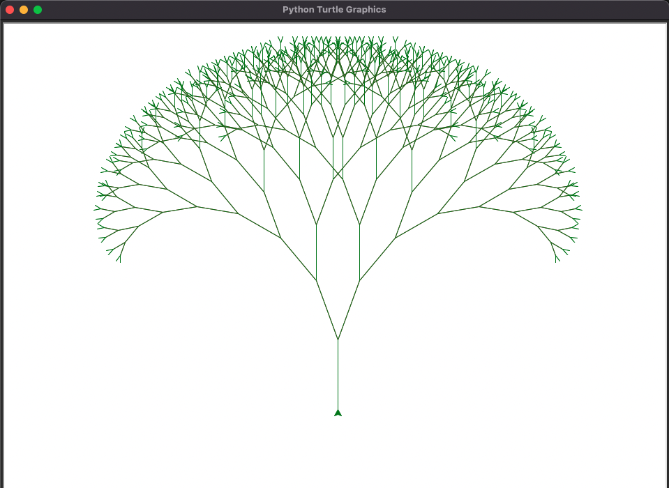

# Fractal Tree Drawing with Python

This project uses Python's `turtle` module to draw a fractal tree.



## Code Overview

The main function is `draw_tree(branch_len, t)`, which draws a branch of the tree and recursively calls itself to draw two more branches at the end.

- `branch_len` represents the current branch's length.
- `t` is a `Turtle` object from the `turtle` module.

This function checks whether the branch length `branch_len` is greater than 3. If it's not, the function returns and does nothing. If it is, the function changes the turtle's color to "green" if `branch_len` is less than 20 (indicating that we're drawing a leaf) or "brown" (indicating that we're drawing a branch). Then the function moves the turtle forward by `branch_len` units, turns it right by 20 degrees, and calls `draw_tree` recursively with a reduced `branch_len`.

After this recursive call returns, the function turns the turtle left by 40 degrees and calls `draw_tree` again, creating a second branch. Once the second branch is drawn, the turtle is returned to its original position and orientation.

The `branch_len` value is decreased by 10 at each level of recursion, making each successive branch shorter than the last.

## Usage

To run the project, you will need Python installed on your machine. Then simply run the Python script:

```bash
# Clone this repository
$ git clone https://github.com/VictorApaez/fractal-tree-python.git

# Go into the repository
$ cd fractal-tree-python

# Run the project
$ python3 main.py
```

You should see a new window open, displaying the fractal tree.

## Dependencies

This project depends on Python's turtle module, which is used for the drawing. You will need to have it installed to run the project.
